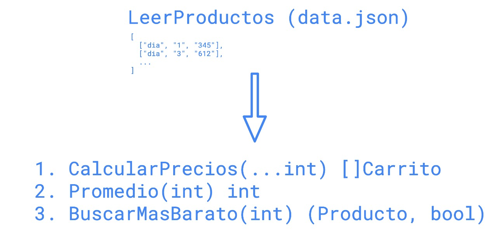

# Primeros pasos en Golang

## TP1
El objetivo de este TP es que practiques cómo iterar slices, mapas, definir métodos, correr tests, user interfaces  y más!

Para los ejercicios de este TP vamos a estar usando un dataset que contiene un conjunto de productos formados de la siguiente manera:
```
[
	["dia", "1", "234"]
]
```

Cada ejercicio tiene una funcion definida en `tp1/tp1.go` que vas a tener que implementar para que sus tests, definidos en `tp1/tp1_test.go`, pasen exitosamente. Estas son las consignas:
* **CalcularPrecios**: Dada una lista de ids de productos la función debería calcular cuál sería el precio total de todos los productos para cada uno de los supermercados. Basicamente, armar un "carrito" para cada super mercado que se encuentra e indicar cuanto saldria comprar esos items en ese super mercado,
* **Promedio**: Dado el id de un producto la función debería calcular cuál es el precio promedio de ese producto utilizando la data de todos los supermercados,
* **BuscarMasBarato**: Recibe el ID de un producto y debería retornar cuál es el super mercado que lo vende más barato y a cuánto lo vende.

La funcion `BuscarMasBarato` retorna una interfaz llamada `Producto`. Vas a tener que definir algun tipo que cumpla con la definicion de esa interfaz para poder resolver el ejercicio.



### ¿Cómo probar tu solución?
Cada una de las funciones definidas en `tp1.go` tiene una `func` escrita en `tp1_test.go` que actúa como *test* de esa función. Ya tenemos un conjunto de casos identificados y escritos en los tests que validan que tu codigo haga lo que corresponde.  

Para validar tus soluciones, podés ejecutar los siguientes comandos parándote en la carpeta de `tp1`:

```
# correr los tests de la funcion sumar. Aca podrian cambiar
# `CalcularPrecios` por el nombre de la funcion que estan probando en el momento
go test -run=TestProductos_CalcularPrecios

# Correr los tests de todas las funciones
go test
```

Si quieren tener más información de los tests, por ejemplo saber cuáles escenarios fallaron, pueden correr el comando con el flag `-v`:
```
go test -v -run=TestProductos_CalcularPrecios
```
